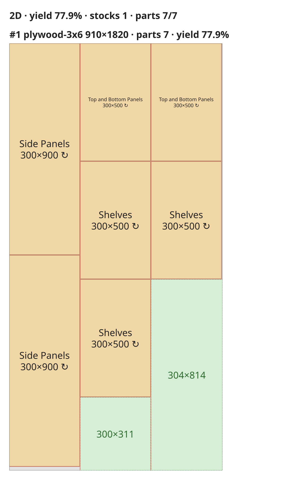
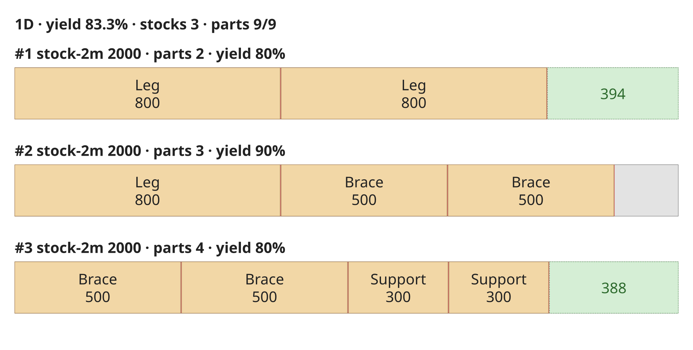

# Wood Cutting Optimizer (木材カット最適化アルゴリズム)

[](LICENSE)


**Wood Cutting Optimizer** は、DIY・木工作業現場・家具製作に特化した、**完全外部依存ゼロ（Zero-dependency）** の木材カットパターン最適化エンジンです。

1次元の棒材（角材・ツーバイフォー材等）および2次元の板材（合板・サブロク板等）の歩留まり最適化を行い、鋸刃の厚み（Kerf）、ギロチンカット制約、木目方向（Grain）、再利用可能端材（Remnants）の識別に対応しています。

TypeScript 実装と Python 実装を同等の最適化アルゴリズム・同一の JSON 入出力仕様で提供しています。

---

## 主な特徴と木工特有の必須制約

一般的な 2D ビンパッキング問題と異なり、実際の木工作業現場で物理的に切断可能なカットプランを算出します。

| 機能 / 制約 | 説明 |
| :--- | :--- |
| **鋸刃の厚み (Saw Kerf)** | 丸ノコやパネルソーの刃厚（例: 2.0mm 〜 3.5mm）を厳密に考慮。カットごとに失われる寸法を計算し、寸法不足や部材重複を防止します。 |
| **ギロチンカット制約 (Guillotine Cuts)** | 板の端から端まで突き抜ける一刀両断カット（Guillotine Cut）を厳密に保証。切断順序（Step）と切断線分座標を出力し、実際のカット作業手順書やSVG描画に直結します。 |
| **木目方向 (Grain Direction)** | 部材ごとに「木目沿い（回転禁止）」または「回転許可」を指定可能。原板の木目方向（縦・横）と部材の木目方向を自動判定します。 |
| **端材 (Remnants) の判定** | 最小再利用可能サイズ（`min_remnant_size`）以上の余白を「再利用可能な端材（Remnant）」としてマークし、ゴミ（Waste/おがくず）と明確に区別します。 |
| **コスト・歩留まり最適化** | 複数のヒューリスティクス（部材の並べ順・配置先の選び方・カット方向・原材の選び方の組み合わせ）を試し、未配置が最少 → 総コスト最小（`cost` 未指定時は面積／長さ）→ 使用数最少 → 端材最大 の解を採用します。サイズや価格の異なる原材が混在しても、安く済む組み合わせを選びます。 |
| **Zero-dependency** | ランタイム外部パッケージへの依存は一切ありません。TypeScript は Node.js 標準のみ、Python は標準ライブラリ（3.9+）のみで動作します。 |

---

## ディレクトリ構成

```text
wood-cutting-optimizer/
├── LICENSE                 # MIT License
├── README.md               # 本ドキュメント
├── AGENTS.md               # AI コーディングエージェント向けガイド
├── .github/workflows/
│   └── ci.yml              # CI（TS / Python テスト、言語間パリティ検証）
├── docs/
│   └── example-*.svg       # README 掲載のカット図面サンプル
├── scripts/
│   └── check_parity.py     # TS と Python の出力（JSON・SVG）一致検証
├── specification/
│   └── schema.json         # 入出力標準 JSON Schema
├── test-cases/             # 言語共通の検証シナリオ（1D / 2D、木目、コスト、数量無制限、trim など）
│   └── *.json
└── packages/
    ├── typescript/         # Zero-dependency TypeScript コア
    │   ├── src/            # 1D/2D 最適化、入力検証、SVG レンダラー、汎用ビンパッキング
    │   ├── bin/cli.ts      # CLI ツール
    │   └── tests/          # node:test による自動検証
    └── python/             # Zero-dependency Python コア
        ├── wood_cutting_optimizer/ # 1D/2D 最適化、入力検証、SVG レンダラー、CLI
        └── tests/          # unittest による自動検証
```

---

## クイックスタート (TypeScript)

### 1. インストール / ビルド

```bash
cd packages/typescript
npm install
npm run build
```

### 2. CLI からの実行

```bash
# JSON ファイルを入力して最適化（標準出力に出力）
node dist/bin/cli.js --input ../../test-cases/2d_guillotine.json

# 出力ファイル名を指定
node dist/bin/cli.js -i input.json -o result.json

# SVG カット図面も出力
node dist/bin/cli.js -i input.json -o result.json --svg cut-plan.svg
```

### 3. コードからの利用 (TypeScript / JavaScript)

```typescript
import { optimize, InputRequest } from 'wood-cutting-optimizer';

const request: InputRequest = {
  dimension: '2D',
  kerf: 3.0,
  min_remnant_size: { width: 150, height: 150 },
  stocks: [
    { id: 'sheet-1', width: 910, height: 1820, quantity: 1, grain: 'length' }
  ],
  parts: [
    { id: 'side', name: '側板', width: 900, height: 300, quantity: 2, can_rotate: true },
    { id: 'shelf', name: '棚板', width: 500, height: 300, quantity: 5, can_rotate: true }
  ]
};

const result = optimize(request);

console.log(`歩留まり: ${(result.summary.yield_rate * 100).toFixed(1)}%`);
console.log(`使用板数: ${result.summary.stock_count_used} 枚`);
```

`optimize()` の戻り値の型は入力の `dimension` に応じて決まります（`'2D'` なら `OptimizationResult2D` で、`result.stocks[0].width` などに型キャストなしでアクセスできます）。`JSON.parse` した入力（`any`）では `OptimizationResult1D | OptimizationResult2D` になり、`result.dimension` で絞り込めます。

---

## クイックスタート (Python)

### 1. セットアップ

Python 3.9 以上に対応。外部パッケージのインストールは不要です。

```bash
cd packages/python
pip install -e .
```

### 2. CLI からの実行

```bash
# モジュールから直接実行
python -m wood_cutting_optimizer ../../test-cases/2d_guillotine.json

# SVG カット図面も出力
python -m wood_cutting_optimizer ../../test-cases/2d_guillotine.json --svg cut-plan.svg

# またはインストール後のコマンド (wood-opt でも実行可能)
wood-cutting-optimizer -i input.json -o result.json
```

### 3. コードからの利用 (Python)

```python
from wood_cutting_optimizer import optimize

data = {
    "dimension": "2D",
    "kerf": 3.0,
    "min_remnant_size": {"width": 150.0, "height": 150.0},
    "stocks": [
        {"id": "sheet-1", "width": 910.0, "height": 1820.0, "quantity": 1, "grain": "length"}
    ],
    "parts": [
        {"id": "side", "name": "側板", "width": 900.0, "height": 300.0, "quantity": 2, "can_rotate": True},
        {"id": "shelf", "name": "棚板", "width": 500.0, "height": 300.0, "quantity": 5, "can_rotate": True}
    ]
}

result = optimize(data)

print(f"歩留まり: {result.summary.yield_rate * 100:.1f}%")
print(f"使用板数: {result.summary.stock_count_used} 枚")
print(f"ギロチンカット数: {len(result.stocks[0].cuts)} 回")
```

---

## SVG カット図面

最適化結果を、原材ごとのカット図面（SVG）として出力できます。部材（名前・寸法、回転した部材は ↻）、再利用可能な端材（緑の破線）、廃材・刃厚ぶん（灰色の背景）、カット線（赤）を描き、カット線にマウスを乗せると切断順（step）が表示されます。





```typescript
import { optimize, renderSvg } from 'wood-cutting-optimizer';

const result = optimize(request);
const svg = renderSvg(result, request); // 第2引数に入力を渡すと部材名でラベル付け
```

```python
from wood_cutting_optimizer import optimize, render_svg

result = optimize(data)
svg = render_svg(result, data)
```

---

## 汎用 1次元ビンパッキング (Generic 1D Bin Packing)

木材カット固有の制約（鋸刃厚 kerf、端材分類、切断順序など）を必要としない、**汎用的な 1D ビンパッキング計算ロジック**も独立したインターフェイスとして提供しています。

ディスク容量配分、荷物梱包、タスク割り当て、予算配分など、任意の一次元容量詰め込み問題にそのままご利用いただけます。

### 主な特徴
- **木材制約フリー**: 刃厚・切断ステップ・端材分類なしでシンプルに利用可能
- **アイテム間隔 (Spacing)**: 必要に応じてアイテム間の最小間隙（パディングやマージン）をオプション指定可能
- **複数戦略の選択**: `best-fit-decreasing` (デフォルト), `first-fit-decreasing`, `worst-fit-decreasing`
- **新規ビンの選び方**: `binSelection`（Python: `bin_selection`）で `smallest`（デフォルト）/ `largest` / `lowest-cost-ratio`（容量あたりコスト最小）を指定可能
- **メタデータの透過保持**: Bin および Item に呼び出し元の独自オブジェクト（ジェネリクス `data`）を付与可能

### TypeScript での利用例

```typescript
import { binPack1D, BinDefinition, ItemDefinition } from 'wood-cutting-optimizer';

const bins: BinDefinition[] = [
  { id: 'server-1', capacity: 100, quantity: 2 },
  { id: 'server-2', capacity: 150, quantity: 1 }
];

const items: ItemDefinition[] = [
  { id: 'job-A', size: 60 },
  { id: 'job-B', size: 40 },
  { id: 'job-C', size: 70 },
  { id: 'job-D', size: 30 }
];

const result = binPack1D(bins, items, {
  strategy: 'best-fit-decreasing'
});

console.log(`使用ビン数: ${result.summary.binsUsed}`);
console.log(`平均充填率: ${(result.summary.averageUtilization * 100).toFixed(1)}%`);
```

### Python での利用例

```python
from wood_cutting_optimizer.binpacking import bin_pack_1d, BinDefinition, ItemDefinition

bins = [
    BinDefinition(id="container-1", capacity=100.0, quantity=2),
    BinDefinition(id="container-2", capacity=150.0, quantity=1),
]

items = [
    ItemDefinition(id="pkg-1", size=60.0),
    ItemDefinition(id="pkg-2", size=40.0),
    ItemDefinition(id="pkg-3", size=70.0),
    ItemDefinition(id="pkg-4", size=30.0),
]

result = bin_pack_1d(bins, items)

print(f"使用ビン数: {result.summary.bins_used}")
print(f"平均充填率: {result.summary.average_utilization * 100:.1f}%")
```


---

## テスト実行 (言語共通シナリオ)

両言語ともに `test-cases/*.json` を入力として同一の検証シナリオを実行します。

### TypeScript テスト (Node.js 組み込み `node:test`)
```bash
cd packages/typescript
npm install
npm test   # dist/ をクリーン → ビルドしてからテストを実行
```

### Python テスト (標準 `unittest`)
```bash
cd packages/python
python -m unittest discover -s tests
```

### TypeScript / Python の出力一致検証
```bash
(cd packages/typescript && npm run build)
python scripts/check_parity.py
```

GitHub Actions（`.github/workflows/ci.yml`）で、上記すべてを push / Pull Request ごとに実行しています。

---

## 入出力データ仕様 (Summary)

完全な仕様は [specification/schema.json](specification/schema.json) を参照してください。

### 出力フォーマットの要点
- `summary`:
  - `yield_rate`: 歩留まり（0.0 〜 1.0）
  - `stock_count_used`: 使用した原材数
  - `total_used_measure`: 部材が占める純面積/純長さ
  - `total_remnant_measure`: 再利用可能な端材の合計
  - `total_waste_measure`: 刃厚による切損および規定サイズ未満の廃棄余白
  - `stock_usage`: 原材の種類ごとの使用数（購入リスト）。`[{ "stock_id", "quantity", "cost" }]`。`cost` は単価×数量（`cost` 未指定の原材は `null`）
- `stocks`:
  - `placements`: 各部材の座標 `(x, y)`、配置寸法 `(width, height)`、回転有無 `rotated`
  - `cuts`: ギロチンカット情報 `(type: "horizontal" | "vertical", x, y, length, kerf, step)`
  - `remnants`: 再利用可能な端材矩形リスト
  - `waste`: 廃棄余白矩形リスト
- `unplaced_parts`: 在庫不足等で収容しきれなかった部材のリスト

### 原材の数量無制限（購入計画）
原材（`stocks`）の `quantity` に `"unlimited"` を指定すると、必要なだけ原材を使って全部材を配置します。「何枚買えばよいか」を求める用途に使えます（部材の `quantity` には指定できません）。

```json
{ "id": "saburoku", "width": 910, "height": 1820, "quantity": "unlimited", "cost": 2500 }
```

### 端の切り落とし（trim）
原材に `trim`（mm）を指定すると、2D は四辺、1D は両端からその幅を切り落としてから部材を配置します（工場出荷時の傷んだ端や、角材の割れた木口を落とす用途）。刃厚ぶんも `trim` に含めて指定してください。切り落とした帯は `waste` に出力され、`cuts` には含まれません。

```json
{ "id": "saburoku", "width": 910, "height": 1820, "quantity": "unlimited", "trim": 5 }
```

### 入力検証
- 仕様に反する入力（負や 0 の寸法、整数でない `quantity`、負の `kerf`、未知の `grain` / `dimension`、`stocks` / `parts` 内での `id` の重複など）はエラーになります（TypeScript: `Error`、Python: `ValueError`。メッセージは `Invalid input: ...`）。
- `cost` を指定すると、使用原材の総コストが最小になる解を優先します。未指定の場合は面積（2D）／長さ（1D）をコストとみなします。
- 端材の判定: 原板が `grain: "none"` なら、余りが `min_remnant_size` を縦横どちらの向きで満たしても端材になります。木目がある原板では向きを固定して判定します。

---

## ロードマップ

- [x] Zero-dependency TypeScript 実装 (1D / 2D Guillotine)
- [x] Zero-dependency Python 実装 (1D / 2D Guillotine)
- [x] 汎用 1D ビンパッキング計算ロジック＆インターフェイス (TypeScript / Python)
- [x] 言語共通 JSON Schema & テストケース駆動検証
- [x] SVG カット図面出力レンダラー（プレビュー機能）

- [ ] Rust コアエンジンへの移植 & WebAssembly (wasm-bindgen) / PyO3 バインディング
- [x] コスト最適化（複数サイズのストックが存在する場合の最小コスト探索）

---

## ライセンス

[MIT License](LICENSE)
